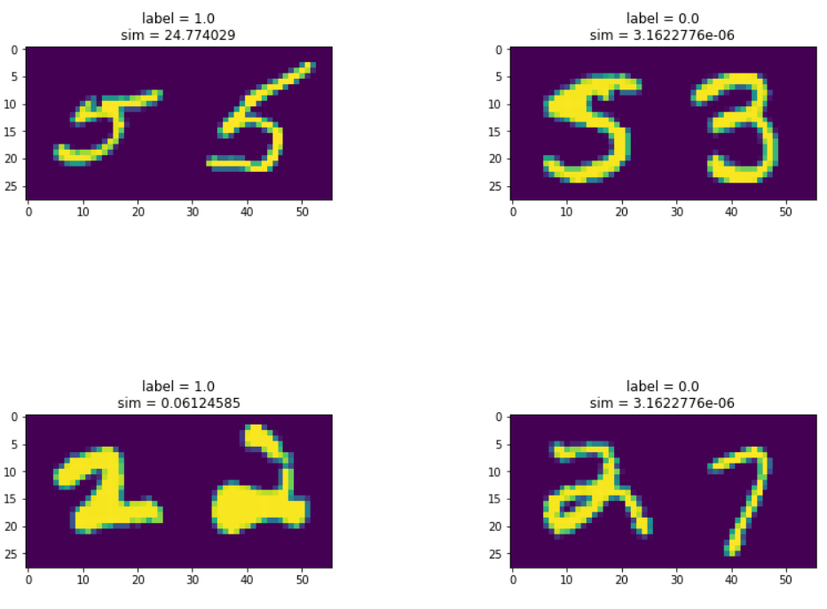

# Siamese-network-on-MNIST-PyTorch
Siamese network creates two virtually separate twin neworks whose goal is to create representations such that representations of objects close belonging to same class are close togeether while representations of objects belonging to different classes are far apart. Siamese networks thus, introduce metric learning using the minimization objective which they named contrastive loss. 

The above has been implemented in a clearly descriptive jupyter notebook.

## Results
Below is the similarity score for images as given by the network.

## Requirements
* Python 3.6
* PyTorch <= 0.4
* Matplotlib
